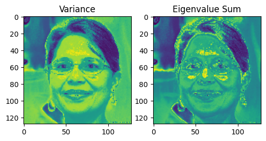
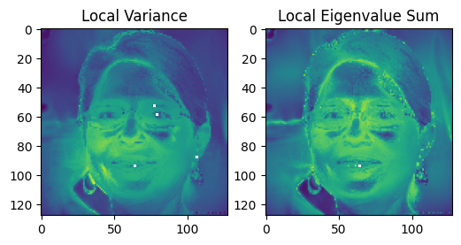
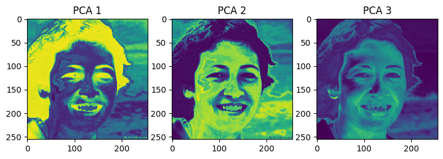
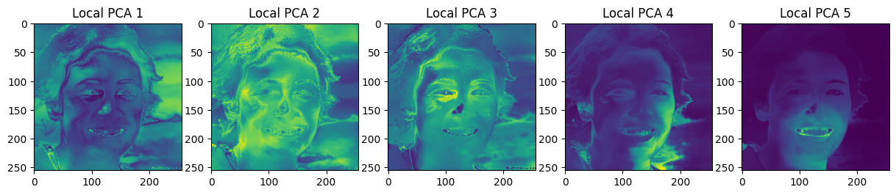

<font size="7">**Graph PCA**</font>

[](https://github.com/YertleTurtleGit/graph-pca/actions/workflows/readme.yml)
<a target="_blank" href="https://colab.research.google.com/github/YertleTurtleGit/graph-pca/blob/main/README.ipynb">

</a>

Performs PCA with optional graph distance for neighborhood composition.

(Still under heavy development.)

<!-- START doctoc generated TOC please keep comment here to allow auto update -->
<!-- DON'T EDIT THIS SECTION, INSTEAD RE-RUN doctoc TO UPDATE -->
**Table of Contents**

- [Installation](#installation)
- [Examples](#examples)
  - [Image](#image)
    - [Eigenvalues](#eigenvalues)
    - [Principal Component Analysis (PCA)](#principal-component-analysis-pca)

<!-- END doctoc generated TOC please keep comment here to allow auto update -->


# Installation


```python
BUILD_BY_YOURSELF = False

if BUILD_BY_YOURSELF:
    !pip install maturin
    !maturin develop
else:
    !pip install -q git+https://github.com/YertleTurtleGit/graph-pca
```

# Examples

## Image


```python
!pip install -q numpy opencv-python matplotlib requests
```


```python
import requests
import numpy as np
import cv2 as cv
from matplotlib import pyplot as plt
import graph_pca
from graph_pca import Feature
```


```python
image_url = "http://thispersondoesnotexist.com/"
image = np.asarray(bytearray(requests.get(image_url).content), dtype=np.uint8)
image = cv.imdecode(image, cv.IMREAD_COLOR)
image = cv.cvtColor(image, cv.COLOR_BGR2RGB)
image = cv.resize(image, (128, 128))
image = image.astype(np.float64) / 255

_ = plt.imshow(image)
```


    

    


```python
h, w, c = image.shape

radius = 0.25
max_edge_length = (
    radius  # this ignores graph distance, because max_edge_length >= radius
)

features = [Feature.Eigenvalues, Feature.PrincipalComponentValues]
```


```python
feature_count = c
image_vectors = image.reshape((w * h, feature_count))

eigenvalues, pca = graph_pca.calculate_features(
    image_vectors, features, radius, max_edge_length
)
```


```python
grid = np.array(np.meshgrid(np.linspace(0, 1, w), np.linspace(0, 1, h)))
image_xy = np.dstack(
    [image[:, :, 0], image[:, :, 1], image[:, :, 2], grid[0, :, :], grid[1, :, :]]
)

feature_count_xy = c + 2
image_vectors_xy = image_xy.reshape((w * h, feature_count_xy))

eigenvalues_xy, pca_xy = graph_pca.calculate_features(
    image_vectors_xy, features, radius, max_edge_length
)
```

### Eigenvalues


```python
eigenvalues = np.array(eigenvalues).reshape(h, w, feature_count)

variance = np.prod(eigenvalues, axis=2) ** (1 / eigenvalues.shape[2])
eigenvalue_sum = np.sum(eigenvalues, axis=2)

figure, axes = plt.subplots(1, 2, figsize=(3 * 2, 3))
axes[0].set_title("Variance")
_ = axes[0].imshow(variance)
axes[1].set_title("Eigenvalue Sum")
_ = axes[1].imshow(eigenvalue_sum)
```


    

    


```python
eigenvalues_xy = np.array(eigenvalues_xy).reshape(h, w, feature_count_xy)

variance_xy = np.prod(eigenvalues_xy, axis=2) ** (1 / eigenvalues_xy.shape[2])
eigenvalue_sum_xy = np.sum(eigenvalues_xy, axis=2)

figure, axes = plt.subplots(1, 2, figsize=(3 * 2, 3))
axes[0].set_title("Local Variance")
_ = axes[0].imshow(variance_xy)
axes[1].set_title("Local Eigenvalue Sum")
_ = axes[1].imshow(eigenvalue_sum_xy)
```

    /tmp/ipykernel_2019/3500178925.py:3: RuntimeWarning: invalid value encountered in power
      variance_xy = np.prod(eigenvalues_xy, axis=2) ** (1 / eigenvalues_xy.shape[2])


    

    


### Principal Component Analysis (PCA)


```python
pca = np.array(pca)

pca_list = []
pca_count = feature_count
for n in range(pca_count):
    pca_list.append(np.clip(pca[:, n].reshape(h, w, 1), 0, 1))

figure, axes = plt.subplots(1, pca_count, figsize=(3 * pca_count, 3))
for n, pca_n in enumerate(pca_list):
    _ = axes[n].imshow(pca_n)
    axes[n].set_title(f"PCA {n+1}")
```


    

    


```python
pca_xy = np.array(pca_xy)

pca_list = []
pca_count = feature_count_xy
for n in range(pca_count):
    pca_list.append(np.clip(pca_xy[:, n].reshape(h, w, 1), 0, 1))

figure, axes = plt.subplots(1, pca_count, figsize=(3 * pca_count, 3))
for n, pca_n in enumerate(pca_list):
    _ = axes[n].imshow(pca_n)
    axes[n].set_title(f"Local PCA {n+1}")
```


    

    

