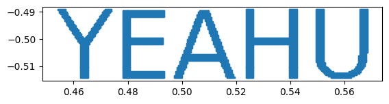
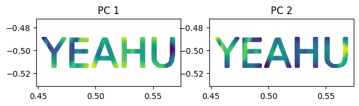
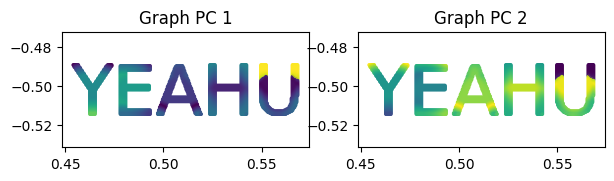

<font size="7">**Graph PCA**</font>

[](https://github.com/YertleTurtleGit/graph-pca/actions/workflows/readme.yml)
<a target="_blank" href="https://colab.research.google.com/github/YertleTurtleGit/graph-pca/blob/main/README.ipynb">

</a>

Performs Principal Component Analysis (PCA) with optional graph distance for neighborhood composition.

<!-- START doctoc -->
<!-- END doctoc -->


# Installation


```python
!apt-get -qq install cargo
%pip install -q pathlib2
import pathlib2 as pathlib

DEV_MODE = pathlib.Path('.git').is_dir() and pathlib.Path.cwd().name == "graph-pca"

if DEV_MODE:
    #%pip install -q maturin
    #!maturin develop
    %pip install .
else:
    %pip install -q git+https://github.com/YertleTurtleGit/graph-pca


```

    E: Could not open lock file /var/lib/dpkg/lock-frontend - open (13: Permission denied)
    E: Unable to acquire the dpkg frontend lock (/var/lib/dpkg/lock-frontend), are you root?


    Note: you may need to restart the kernel to use updated packages.


    Defaulting to user installation because normal site-packages is not writeable


    Processing /home/runner/work/graph-pca/graph-pca


      Installing build dependencies ... [?25l-

     \

     |

     /

     done


    [?25h  Getting requirements to build wheel ... [?25ldone


    [?25h  Preparing metadata (pyproject.toml) ... [?25l-

     \

     |

     /

     -

     \

     | done
    [?25hBuilding wheels for collected packages: graph_pca


      Building wheel for graph_pca (pyproject.toml) ... [?25l-

     \

     |

     /

     -

     \

     |

     /

     -

     \

     |

     /

     -

     \

     |

     /

     -

     \

     |

     /

     -

     \

     |

     /

     -

     \

     |

     /

     -

     \

     |

     /

     -

     \

     |

     /

     -

     done
    [?25h  Created wheel for graph_pca: filename=graph_pca-0.2.0-cp310-cp310-linux_x86_64.whl size=256194 sha256=b3f6edf8d07df9a74b2a991d4b44e687827b4b5feddaaef7259143de4869a696
      Stored in directory: /home/runner/.cache/pip/wheels/7b/c4/c0/8f5feb247149d5b104495eb30718e47a9918e3e64bbd443a56
    Successfully built graph_pca


    Installing collected packages: graph_pca
    Successfully installed graph_pca-0.2.0


    Note: you may need to restart the kernel to use updated packages.


# Example


```python
%pip install -q numpy opencv-python matplotlib requests
```

    Note: you may need to restart the kernel to use updated packages.


```python
import numpy as np
from matplotlib import pyplot as plt
import graph_pca
from graph_pca import Feature
```


```python
# generate test data

fig, ax = plt.subplots(figsize=(20, 20))
ax.set_facecolor("white")
text = "YEAHU"
ax.text(
    0.5,
    0.5,
    text,
    fontsize=50,
    color="black",
    ha="center",
    va="center",
    transform=ax.transAxes,
)

ax.set_xticks([])
ax.set_yticks([])
ax.set_frame_on(False)

fig.canvas.draw()
image = np.array(fig.canvas.renderer.buffer_rgba())
plt.close(fig)

h, w, _ = image.shape
grid = np.array(np.meshgrid(np.linspace(0, 1, w), np.linspace(0, 1, h)))
points = np.dstack([grid[0, :, :], grid[1, :, :]])
points = points[image[:, :, 0] == 0]
points[:, 1] *= -1

plt.gca().set_aspect("equal")
_ = plt.scatter(points[:, 0], points[:, 1], s=3)
```


    

    


```python
radius = 0.02
features = [Feature.Eigenvalues, Feature.PrincipalComponentValues]
pc_count = points.shape[1]
```

## Classic PCA


```python
eigenvalues_xy_graph, pca_xy_graph = np.array(
    graph_pca.calculate_features(points, features, radius)
)
```


```python
figure, axes = plt.subplots(1, pc_count, figsize=(3.5 * pc_count, 1.5))
for n in range(pc_count):
    _ = axes[n].scatter(points[:, 0], points[:, 1], c=pca_xy_graph[:, n], s=3)
    axes[n].axis("equal")
    axes[n].set_title(f"PC {n+1}")
```


    

    


## Graph PCA


```python
max_edge_length = 0.001
eigenvalues_xy_graph, pca_xy_graph = np.array(
    graph_pca.calculate_features(points, features, radius, max_edge_length)
)
```


```python
figure, axes = plt.subplots(1, pc_count, figsize=(3.5 * pc_count, 1.5))
for n in range(pc_count):
    _ = axes[n].scatter(points[:, 0], points[:, 1], c=pca_xy_graph[:, n], s=3)
    axes[n].axis("equal")
    axes[n].set_title(f"Graph PC {n+1}")
```


    

    

