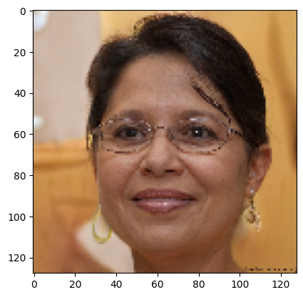
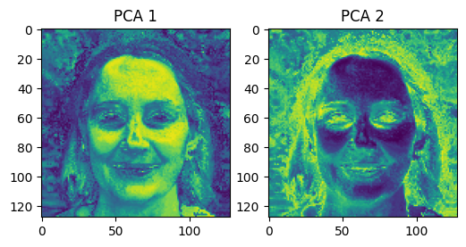
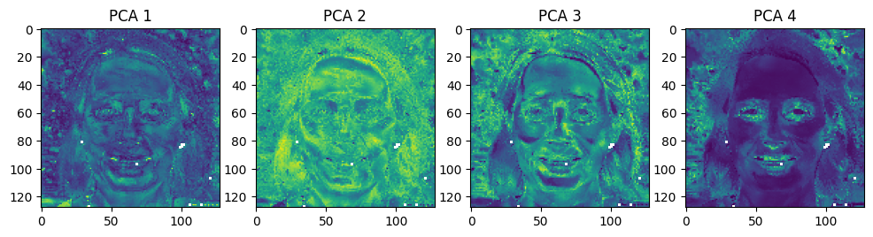

<font size="7">**Graph PCA**</font>

[](https://github.com/YertleTurtleGit/graph-pca/actions/workflows/readme.yml)
<a target="_blank" href="https://colab.research.google.com/github/YertleTurtleGit/graph-pca/blob/main/README.ipynb">

</a>

Performs PCA with optional graph distance for neighborhood composition.

(Still under heavy development.)

<!-- START doctoc -->
<!-- END doctoc -->


# Installation


```python
BUILD_BY_YOURSELF = False

if BUILD_BY_YOURSELF:
    !pip install maturin
    !maturin develop
else:
    !pip install -q git+https://github.com/YertleTurtleGit/graph-pca
```

# Examples

## Image


```python
!pip install -q numpy opencv-python matplotlib requests
```


```python
import requests
import numpy as np
import cv2 as cv
from matplotlib import pyplot as plt
import graph_pca
```


```python
image_url = "http://thispersondoesnotexist.com/"
image = np.asarray(bytearray(requests.get(image_url).content), dtype=np.uint8)
image = cv.imdecode(image, cv.IMREAD_COLOR)
image = cv.cvtColor(image, cv.COLOR_BGR2RGB)
image = cv.resize(image, (128, 128))
h, w, c = image.shape

_ = plt.imshow(image)
```


    

    


```python
radius = 0.1
max_edge_length = (
    radius  # this ignores graph distance, because max_edge_length >= radius
)

image = image.astype(np.float64) / 255
h, w, c = image.shape
image_vectors = image.reshape((w * h, c))

feature_count = c

pca = graph_pca.calculate(image_vectors, radius, max_edge_length)

pca = np.array(pca)

pca_list = []
pca_count = feature_count - 1
for n in range(pca_count):
    pca_list.append(np.clip(pca[:, n].reshape(h, w, 1), 0, 1))

figure, axes = plt.subplots(1, pca_count, figsize=(3 * pca_count, 3))
for n, pca_n in enumerate(pca_list):
    _ = axes[n].imshow(pca_n)
    axes[n].set_title(f"PCA {n+1}")
```


    

    


```python
# This adds the pixel coordinates as features
grid = np.array(np.meshgrid(np.linspace(0, 1, w), np.linspace(0, 1, h)))
image_xy = np.dstack(
    [image[:, :, 0], image[:, :, 1], image[:, :, 2], grid[0, :, :], grid[1, :, :]]
)

# Transform the image in an array with 5 normalized features per data point: RGB+XY
feature_count = c + 2
image_vectors = image_xy.reshape((w * h, feature_count))

pca = graph_pca.calculate(image_vectors, radius, max_edge_length)
pca = np.array(pca)

pca_list = []
pca_count = feature_count - 1
for n in range(pca_count):
    pca_list.append(np.clip(pca[:, n].reshape(h, w, 1), 0, 1))

figure, axes = plt.subplots(1, pca_count, figsize=(3 * pca_count, 3))
for n, pca_n in enumerate(pca_list):
    _ = axes[n].imshow(pca_n)
    axes[n].set_title(f"PCA {n+1}")
```


    

    

