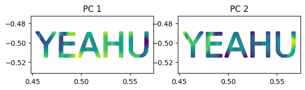
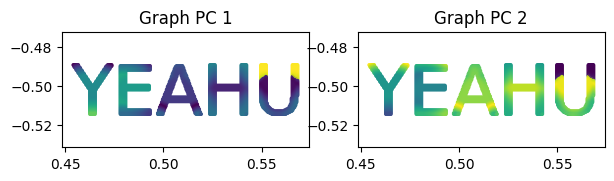

<font size="7">**Graph PCA**</font>

[](https://github.com/YertleTurtleGit/graph-pca/actions/workflows/readme.yml)
<a target="_blank" href="https://colab.research.google.com/github/YertleTurtleGit/graph-pca/blob/main/README.ipynb">

</a>

Performs Principal Component Analysis (PCA) with optional graph distance for neighborhood composition.

<!-- START doctoc generated TOC please keep comment here to allow auto update -->
<!-- DON'T EDIT THIS SECTION, INSTEAD RE-RUN doctoc TO UPDATE -->
**Table of Contents**

- [Geodesic Graph Distance](#geodesic-graph-distance)
  - [Why?](#why)
  - [What?](#what)
  - [Results](#results)
  - [Why not?](#why-not)
- [Installation](#installation)
- [Example](#example)
  - [Classic PCA](#classic-pca)
  - [Graph PCA](#graph-pca)

<!-- END doctoc generated TOC please keep comment here to allow auto update -->


# Geodesic Graph Distance

## Why?
'Classic' (Euclidean distance) neighborhood search in point clouds has some downsides when it comes to structures that are thin in one dimension and close in proximity to the neighborhood radius (e.g., small twigs in a lidar scan of a tree). When computing geometric features using such a classic neighborhood approach, it is possible for adjacent twigs to interfere with each other in a way that the geometric features do not accurately represent an individual twig.

## What?
The method to prevent that was well visualized here:

*Fig. 4 from the paper: Jiang, Anling, et al. "Skeleton extraction from point clouds of trees with complex branches via graph contraction." The Visual Computer 37 (2021): 2235-2251.*

and is also implemented in PyVista for single paths and meshes:

*Image from: https://docs.pyvista.org/version/stable/examples/01-filter/geodesic.html*

It will compute the classic neighborhood and filter out any points that cannot be reached with edges, where each individual edge must be smaller or equal to max_graph_edge_length, and the cumulative sum of the edges must be smaller or equal to search_radius.

## Results

`max_edge_length=0.5` (both)
`max_edge_length=0.1` (only for Geodesic distance)

| Feature   |      'Classic' (only Euclidean distance)      |  Geodesic distance |
|-------------|:-------------:|:-------------:|
| Neighborhood size |  |  |
| Eigenvalue 1 |  |  |
| PC2 |  |  |

## Why not?
- it's slow
- it requires more RAM
- you have to decide on two parameters instead of one :smile: 

# Installation


```python
!apt-get -qq install cargo
%pip install -q pathlib2
import pathlib2 as pathlib

DEV_MODE = pathlib.Path('.git').is_dir() and pathlib.Path.cwd().name == "graph-pca"

if DEV_MODE:
    #%pip install -q maturin
    #!maturin develop
    %pip install .
else:
    %pip install -q git+https://github.com/YertleTurtleGit/graph-pca


```

    E: Could not open lock file /var/lib/dpkg/lock-frontend - open (13: Permission denied)
    E: Unable to acquire the dpkg frontend lock (/var/lib/dpkg/lock-frontend), are you root?


    Note: you may need to restart the kernel to use updated packages.


    Defaulting to user installation because normal site-packages is not writeable


    Processing /home/runner/work/graph-pca/graph-pca


      Installing build dependencies ... [?25l-

     \

     |

     /

     done


    [?25h  Getting requirements to build wheel ... [?25ldone


    [?25h  Preparing metadata (pyproject.toml) ... [?25l-

     \

     |

     /

     -

     \

     |

     done
    [?25hBuilding wheels for collected packages: graph_pca
      Building wheel for graph_pca (pyproject.toml) ... [?25l-

     \

     |

     /

     -

     \

     |

     /

     -

     \

     |

     /

     -

     \

     |

     /

     -

     \

     |

     /

     -

     \

     |

     /

     -

     \

     |

     /

     -

     \

     |

     /

     -

     \

     |

     done
    [?25h  Created wheel for graph_pca: filename=graph_pca-0.2.0-cp310-cp310-linux_x86_64.whl size=261599 sha256=6a112c2f78ff62505fb3563d8fa18fbe86be43903dd7ae1f3887a96ee323fc0a
      Stored in directory: /home/runner/.cache/pip/wheels/7b/c4/c0/8f5feb247149d5b104495eb30718e47a9918e3e64bbd443a56
    Successfully built graph_pca


    Installing collected packages: graph_pca


    Successfully installed graph_pca-0.2.0


    Note: you may need to restart the kernel to use updated packages.


# Example


```python
%pip install -q numpy opencv-python matplotlib requests
```

    Note: you may need to restart the kernel to use updated packages.


```python
import numpy as np
from matplotlib import pyplot as plt
import graph_pca
from graph_pca import Feature
```


```python
# generate test data

fig, ax = plt.subplots(figsize=(20, 20))
ax.set_facecolor("white")
text = "YEAHU"
ax.text(
    0.5,
    0.5,
    text,
    fontsize=50,
    color="black",
    ha="center",
    va="center",
    transform=ax.transAxes,
)

ax.set_xticks([])
ax.set_yticks([])
ax.set_frame_on(False)

fig.canvas.draw()
image = np.array(fig.canvas.renderer.buffer_rgba())
plt.close(fig)

h, w, _ = image.shape
grid = np.array(np.meshgrid(np.linspace(0, 1, w), np.linspace(0, 1, h)))
points = np.dstack([grid[0, :, :], grid[1, :, :]])
points = points[image[:, :, 0] == 0]
points[:, 1] *= -1

plt.gca().set_aspect("equal")
_ = plt.scatter(points[:, 0], points[:, 1], s=3)
```


    

    


```python
radius = 0.02
features = [Feature.Eigenvalues, Feature.PrincipalComponentValues]
pc_count = points.shape[1]
```

## Classic PCA


```python
eigenvalues_xy_graph, pca_xy_graph = np.array(
    graph_pca.calculate_features(points, features, radius)
)
```


```python
figure, axes = plt.subplots(1, pc_count, figsize=(3.5 * pc_count, 1.5))
for n in range(pc_count):
    _ = axes[n].scatter(points[:, 0], points[:, 1], c=pca_xy_graph[:, n], s=3)
    axes[n].axis("equal")
    axes[n].set_title(f"PC {n+1}")
```


    

    


## Graph PCA


```python
max_edge_length = 0.001
eigenvalues_xy_graph, pca_xy_graph = np.array(
    graph_pca.calculate_features(points, features, radius, max_edge_length)
)
```


```python
figure, axes = plt.subplots(1, pc_count, figsize=(3.5 * pc_count, 1.5))
for n in range(pc_count):
    _ = axes[n].scatter(points[:, 0], points[:, 1], c=pca_xy_graph[:, n], s=3)
    axes[n].axis("equal")
    axes[n].set_title(f"Graph PC {n+1}")
```


    

    

