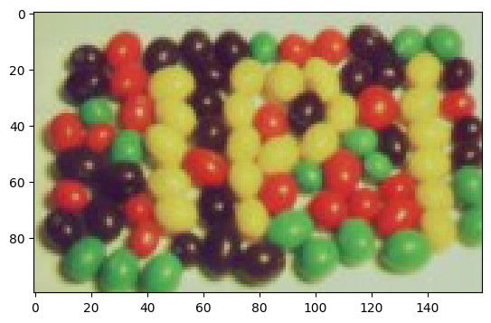
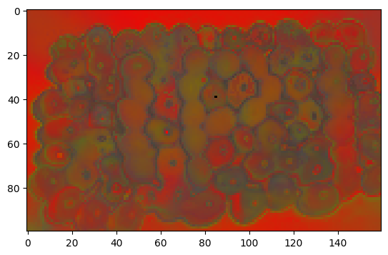

# Graph PCA

Performs PCA with optional graph distance for neighborhood composition.

(Still under heavy development.)

# Examples

## Image


```python
BUILD_BY_YOURSELF = False

if BUILD_BY_YOURSELF:
    !pip install maturin
    !maturin develop
else:
    !pip install -q git+https://github.com/YertleTurtleGit/graph-pca

!pip install -q numpy scikit-image matplotlib
```


```python
import numpy as np
from skimage import io
from matplotlib import pyplot as plt
import graph_pca
```


```python
image = io.imread(
    "https://upload.wikimedia.org/wikipedia/commons/thumb/b/b6/SIPI_Jelly_Beans_4.1.07.tiff/lossy-page1-256px-SIPI_Jelly_Beans_4.1.07.tiff.jpg"
)
image = image[80:180, 40:200, :3]
_ = plt.imshow(image)

image = image.astype(np.float64) / 255
h, w, c = image.shape

# This adds the pixel coordinates as features
grid = np.array(np.meshgrid(np.linspace(0, 1, w), np.linspace(0, 1, h)))
image = np.dstack(
    [image[:, :, 0], image[:, :, 1], image[:, :, 2], grid[0, :, :], grid[1, :, :]]
)

# Transform the image in an array with 5 normalized features per data point: RGB+XY
image = image.reshape((w * h, c + 2))
```


    

    


```python
radius = 0.3
max_edge_length = 0.15
pca = graph_pca.calculate(image, radius, max_edge_length)
```


```python
pca = np.array(pca)
_ = plt.imshow(np.clip(pca[:, :3].reshape(h, w, 3), 0, 1))
```

    /home/runner/.local/lib/python3.10/site-packages/matplotlib/cm.py:494: RuntimeWarning: invalid value encountered in cast
      xx = (xx * 255).astype(np.uint8)


    

    

